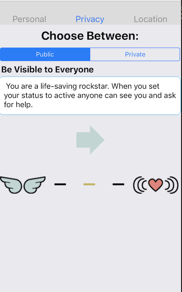

Respondr increases the effectiveness and extends the reach of trained people carrying Narcan / Naloxone by providing real time alerts and directions to nearby individuals witnessing an overdose.

# [View Our Press Release](https://lintlions.github.io/Respondr/docs/press.html) #

## Team

Made with love by:
  - [Will Damon](https://github.com/wdamon)
  - Ben Cooley
  - Jenny Cheng
  - Matthew Smith

## Table of Contents

1. [Usage](#Usage)
1. [Requirements](#requirements)
1. [Development](#development)
    1. [Installing Dependencies](#installing-dependencies)
    1. [Tasks](#tasks)
1. [Team](#team)
1. [Contributing](#contributing)

## Usage
>Annonymous users can ask for help by pressing the help button at the bottom of the screen.

  

>Users who are asking for help only share their location with our servers, protecting their privacy.

>After requesting help a beacon is emitted from the user's location. Responders who are online and nearby are queried one at a time, ordered by their distance from their beacon, and asked if they are able to assist. 

>Responders who say yes accept a beacon and are given direcitons to the beacons location. Their route is depicted on the app for both the responder and the beacon to see. The responder and the beacon and are able to chat in order to arrange for a drop off location. Responders are not given any personally identifying information for the beacon, only direction to the beacons location and a chat window. 

>Responders are able to cancel a mission. If a responder cancels a mission a new beacon is emitted for other nearby responders. 

>Beacons can cancel their help request at any time. And the responder is immediately notified.

## Responders can login or signup.

 

>New responder can choose to be public ( and visible on the map to anyone with the app installed) or private and only visible >when they are matched with the beacon. 

Responders can update their profile preferences (including their setting privacy) at any time in the profile menu accessed from the menu button.

## Responders can also register as mobile or  static locations. 

Static markers are displayed on the map but cannot receive beacons.

## Requirements

- Node 0.10.x
- Redis 2.6.x
- Postgresql 9.1.x
- React Native ^0.46.4,
- React Native Maps ^0.15.3,
- Redux ^3.7.1",
- Redux Thunk ^2.2.0,
- React Native Background Geolocation ^2.8.4,
- Push Notification IoS,

## Development

## Installing Dependencies

From within the root directory:

 - npm install
 - set up a config file and an env file  (refer to .envEXAMPLE and .configEXAMPLE)
 - npm run ios
 - npm run server
 

## Roadmap

View the project roadmap [here](https://github.com/LintLions/Respondr/issues)

## Contributing

See [CONTRIBUTING.md](CONTRIBUTING.md) for contribution guidelines.

## Project Name
Respondr

## License

This project is licensed under the MIT License - see the [LICENSE.md](LICENSE.md) file for details

